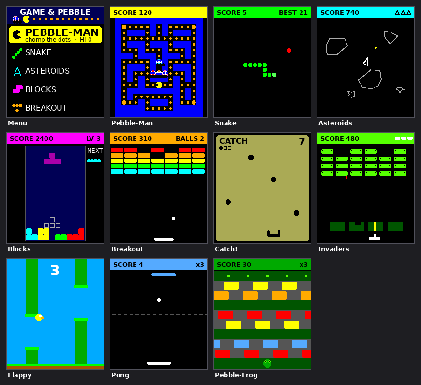

# 🎮 Game & Pebble

A pocketful of classic arcade games for your wrist — built for the **Pebble
Time 2** (and every other modern Pebble). Inspired by those little Nintendo
LCD watch‑games, but with a whole cartridge's worth of titles in one app.



> The image above is an illustrative render of each screen at the Pebble Time 2
> resolution (200×228). It mirrors the layout code in `src/c`, but it isn't an
> emulator capture.

## The games

| Game | What it is | Controls |
|------|------------|----------|
| **Pebble‑Man** | Munch every pellet in the maze, dodge four ghosts, grab a power pellet to eat them back | `UP` turn left · `DOWN` turn right |
| **Snake** | Eat apples, grow, don't bite yourself | `UP` turn left · `DOWN` turn right |
| **Asteroids** | Vector‑graphics ship; rotate, thrust, and shoot the rocks into gravel | `UP`/`DOWN` rotate · `SELECT` tap = fire, hold = thrust |
| **Blocks** | The falling‑tetromino classic, with a ghost piece and next‑piece preview | `UP`/`DOWN` move · `SELECT` tap = rotate, hold = soft drop |
| **Breakout** | Bounce the ball, clear the bricks, keep it in play | `UP`/`DOWN` paddle · `SELECT` launch |
| **Catch!** | A Game & Watch‑style LCD homage: slide the basket to catch falling eggs | `UP`/`DOWN` move basket |
| **Pebble Invaders** | Hold the line against the descending alien horde, behind eroding bunkers | `UP`/`DOWN` move · `SELECT` fire |
| **Flappy** | Tap to flap, thread the gaps between pipes | `SELECT`/`UP` flap |
| **Pong** | Rally against a CPU paddle; miss three and it's over | `UP`/`DOWN` paddle · `SELECT` serve |
| **Pebble‑Frog** | Hop across lanes of traffic to the far bank, faster every round | `SELECT` forward · `UP` left · `DOWN` right |

In every game, **`BACK`** returns to the menu, **`SELECT`** restarts after a
game over, and your **high score is saved** between launches.

On the menu, `UP`/`DOWN` pick a game and `SELECT` plays it. `BACK` exits.

## Install the pre‑built app

Every push builds a `.pbw` you can download and side‑load:

1. Open the latest run under the repo's **Actions → Build Pebble app**.
2. Download the **`Game-and-Pebble-pbw`** artifact and unzip it.
3. In the official Pebble phone app: **Settings → Developer Mode → ON**, then
   open the `.pbw` (e.g. AirDrop / share it to your phone) and tap install,
   or use `pebble install --phone <ip>` from the SDK.

The bundle targets `basalt`, `chalk`, `diorite`, `emery`, `flint` and `gabbro`,
so the same file works on the Time 2 and the other colour/mono Pebbles.

## Build it yourself

You need the Pebble SDK. The quickest path (Linux/macOS):

```bash
# 1. Install the command-line tool in an isolated environment
python3 -m venv ~/.venvs/pebble        # Python 3.10–3.13
~/.venvs/pebble/bin/pip install pebble-tool
export PATH="$HOME/.venvs/pebble/bin:$PATH"

# 2. Install the SDK (downloads the ARM toolchain)
pebble sdk install latest

# 3. Build
git clone https://github.com/l-k-m/game-and-pebble
cd game-and-pebble
pebble build                # -> build/Game-and-Pebble.pbw
```

Run it in the emulator with `pebble install --emulator emery` (needs SDL2),
or on a watch with `pebble install --phone <phone-ip>`.

See the official docs at <https://developer.repebble.com/> for SDK setup help.

## How it's put together

```
src/c/
├── gp.h            shared framework: game roster, high-score + drawing helpers
├── gp_common.c     high scores (persistent), HUD, game-over overlay
├── main.c          animated scrolling menu + app lifecycle
└── games/
    ├── pebbleman.c  maze + ghost AI (chase / frightened) + power pellets
    ├── snake.c      ring-buffer snake, relative steering
    ├── asteroids.c  trig-based rotation/thrust, splitting asteroids, wrap
    ├── blocks.c     7 tetrominoes, wall kicks, line clears, levels
    ├── breakout.c   float ball physics, paddle english, bricks
    ├── catch.c      discrete-step LCD game in the Game & Watch style
    ├── invaders.c   marching formation, eroding bunkers, bombs, waves
    ├── flappy.c     one-button gravity/flap, scrolling pipes
    ├── pong.c       ball physics + a CPU paddle that tracks with lag
    └── frog.c       lane-crossing with scrolling traffic patterns
```

Each game owns its own `Window` and exposes a single `*_push()` entry point.
The maze is generated/validated with `tools/verify_maze.py` (flood‑fill
connectivity check) and the launcher icon with `tools/make_icon.py`.

## Credits

Made with care for a brand‑new Pebble Time 2. The classics it riffs on —
Pac‑Man, Asteroids, Snake, Tetris, Breakout, and the Game & Watch handhelds —
belong to their respective creators; this is an affectionate homage.
